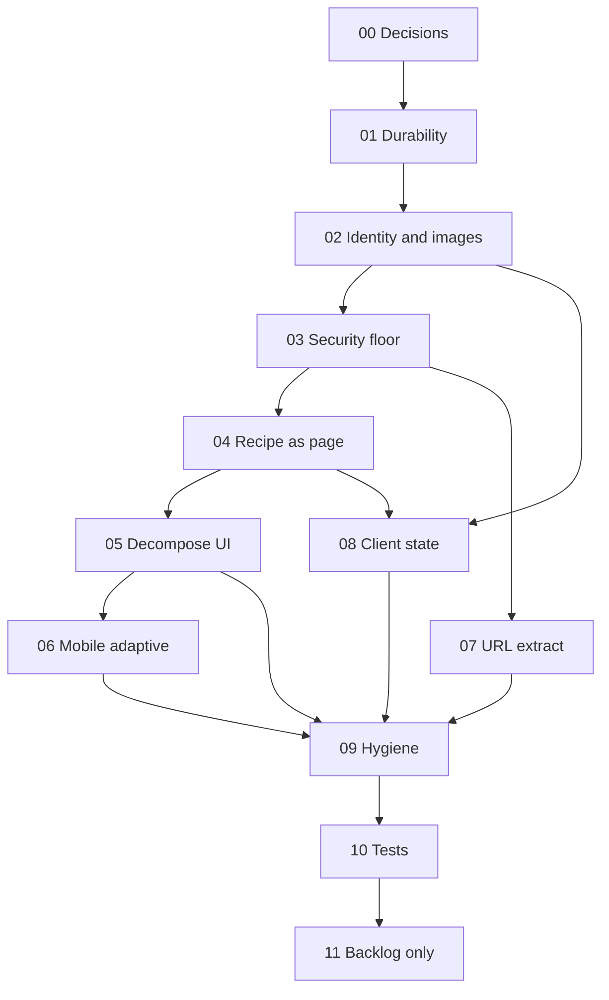

# Post-Review Hardening Plan

**Status:** IMPLEMENTED (phases 01–10 on `feat/post-review-hardening`; phase 11 parked)  
**Date:** 2026-08-30  
**Source:** Full-codebase review (architecture, backend, data model, security, mobile-first UI, frontend correctness)  
**UI language:** German  
**Runtime:** Single-user local / Raspberry Pi, JSON store, Tailscale as network ACL  

This is the current implementation plan. The older Supabase MVP plan (`IMPLEMENTATION.md`) and the completed Pi migration (`completed/LOCAL_PI_OPTION_A_PLAN.md`) are historical.

## Why this plan exists

The local store queue, image upload pipeline, and German library chrome are worth keeping. The overlay-as-application, pre-id image files, leftover multi-user types, and kitchen-UX holes make the product harder than it needs to be.

The simplification that deletes whole classes of bugs:

1. One recipe identity (create, image, delete, undo, collections share the same `id`).
2. One recipe form (add preview, manual, edit).
3. One store mutation primitive (including import and first-boot).
4. Recipe is a **page**, not a 1561-line dialog.

## Locked product decisions

These are not up for debate during this work unless the owner explicitly changes them.

| Decision | Rule |
|---|---|
| Pinch-zoom | **Stay disabled.** Keep `viewport.maximumScale: 1` in `src/app/layout.tsx`. Do **not** add a zoom-enable ticket. Compensate with cook-readable type, 44px controls, and a full-viewport recipe page so zoom is genuinely unnecessary. |
| Auth | Stay single-user. No in-app login. Tailscale / host firewall remains the ACL. Cheap optional pin is in Phase 03, not a user-account system. |
| Database engine | Stay on JSON for Phases 01–10. SQLite is Phase 11 backlog. |
| Supabase | Do not reintroduce. Delete leftovers in Phase 09. |
| Light mode | Backlog (Phase 11). Stay dark-only. |
| Encrypted keys at rest | Backlog (Phase 11). Phase 03 splits secrets out of recipe backups; it does not add PBKDF2. |
| Language | German UI copy everywhere user-facing. English only in code identifiers and comments. Address the user as **du**, never Sie. |
| Categories / difficulty | Unchanged enums: `starter\|main\|dessert\|side\|breakfast\|snack` and `easy\|medium\|hard`. Canonical German labels: **Einfach / Mittel / Schwer** (retire “Leicht”). |

## Phase map

Implement in order. A later phase may assume earlier invariants (durable store, UUID image names, recipe routes).

| Phase | Folder | Goal | Risk if skipped |
|---|---|---|---|
| 00 | [post-review/00-decisions.md](post-review/00-decisions.md) | Decisions, invariants, file map, DoD | Drift while implementing |
| 01 | [post-review/01-data-loss-durability.md](post-review/01-data-loss-durability.md) | Corrupt JSON must not wipe the library; durable writes; import on the queue | SD-card / crash data loss |
| 02 | [post-review/02-recipe-identity-images.md](post-review/02-recipe-identity-images.md) | Images named `{recipeId}.webp`; delete/undo keep identity; cascade collections | Orphan files, broken undo, ghost collection members |
| 03 | [post-review/03-security-floor.md](post-review/03-security-floor.md) | Gitignore secrets, SSRF denylist, UUID image writes, backup without keys, bind/firewall | LAN superuser, credential leak, path traversal |
| 04 | [post-review/04-recipe-as-page.md](post-review/04-recipe-as-page.md) | `/library/[id]` is the recipe surface; print works; collections reuse it | Hardware back, print, collections stub, overlay spaghetti |
| 05 | [post-review/05-decompose-recipe-ui.md](post-review/05-decompose-recipe-ui.md) | Split god component; one form, one tags editor, one image picker | 1561-line file keeps growing |
| 06 | [post-review/06-mobile-adaptive-ui.md](post-review/06-mobile-adaptive-ui.md) | Mobile-first adaptive layouts, German add-flow, safe-areas; zoom stays off | Kitchen unusable; desktop still a stretched phone |
| 07 | [post-review/07-url-extract-pipeline.md](post-review/07-url-extract-pipeline.md) | JSON-LD is AI input, not the German recipe; safe fetch; relative images | English recipes, missing photos, SSRF leftover |
| 08 | [post-review/08-client-state-shopping.md](post-review/08-client-state-shopping.md) | Shopping/favorites/extract state follows server results | Temp-id bugs, snap-back, stale collections |
| 09 | [post-review/09-hygiene-docs-types.md](post-review/09-hygiene-docs-types.md) | Drop dummy profile/`user_id`, empty auth dirs, stale docs | Two architectures in one repo |
| 10 | [post-review/10-tests.md](post-review/10-tests.md) | Tests that would have caught this review | Regressions on the new invariants |
| 11 | [post-review/11-backlog.md](post-review/11-backlog.md) | SQLite, light mode, true masonry, cook mode, encrypted keys | Explicitly **not** this round |



Phases 07 and 08 can overlap with 04–06 after 02–03 are done, as long as they do not reintroduce overlay-only recipe state.

## Definition of done (whole plan, excluding 11)

- Killing power during a write cannot silently replace the library with an empty default store.
- Deleting a recipe removes its image files and collection membership. Undo restores the **same** `id`.
- New images live at `DATA_DIR/recipe-images/{recipeId}.webp`.
- `.env.docker` cannot be committed. Backup JSON does not contain API keys. Outbound fetch rejects private/loopback hosts.
- Opening a recipe is a URL. Browser/Android back closes it. Print prints the recipe. Collections open the same view.
- `recipe-detail.tsx` no longer exists as a 1500+ line file.
- Add-recipe is German, camera-first, a sheet on small screens. `maximumScale` remains `1`.
- URL extract always produces German metric recipes when AI is configured.
- Shopping add-then-toggle works. No `temp-*` ids. Favorites on collection cards persist visually.
- No empty auth route dirs, no `supabase/` runtime leftovers, no `user_id` on recipes, `VISION.md` matches local Pi.
- `npm run build` and `npm run lint` pass. Phase 10 tests cover the invariants above.

## Verification (every phase)

```bash
npm run build
npm run lint
```

Phase 10 adds Playwright / unit tests. Do not wait until Phase 10 to run build.

## Out of scope for Phases 01–10

- Enabling pinch-zoom / removing `maximumScale: 1`
- Rebuilding auth, multi-user, or Supabase
- Meal planner, nutrition, public sharing
- Real AI image generation (the current “generate in the picker” toast is a lie — delete it, do not implement it here)
- Light/dark toggle
- SQLite migration
- Encrypting `tiptopf.json` / secrets with a user password
